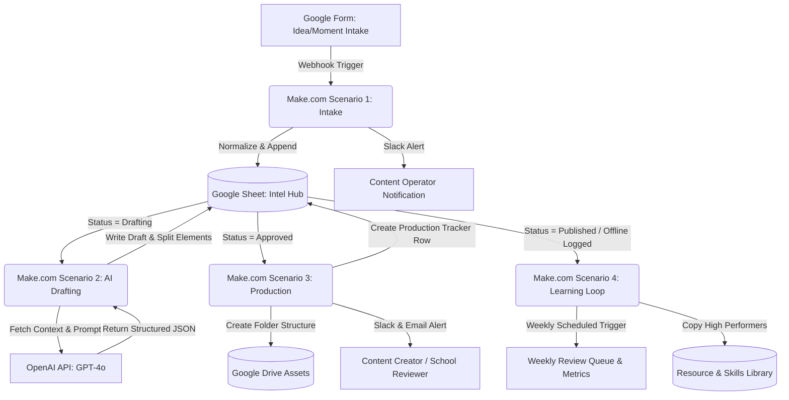

# IMOL Content & School Initiative Automation System: Master Architecture

Welcome to the automation blueprint folder for the **#IMOL (In My Own Lane) Content and School Initiative Operating System**. This folder contains production-ready, highly detailed technical blueprints for **Make.com** (formerly Integromat) that automate the lifecycle of content ideas and school outreach initiatives from intake to drafting, production, publishing, and weekly analytics reviews.

---

## 1. System Architecture Overview

The system utilizes a central **Intel Hub (Google Sheets)** as the database of record, connecting front-end intake (Google Forms), AI processing (OpenAI API), asset management (Google Drive), and team communication (Slack and Email). 

---

## 2. Shared API Connections & Authentication Settings

To implement these blueprints, you must establish the following connections in Make.com. Ensure the account credentials used have administrative or write access to the respective folders and channels.

| Connection Name in Make | Target Service | Authentication Type | Scopes / Permissions Required |
| :--- | :--- | :--- | :--- |
| **Google Sheets (IMOL System)** | Google Sheets | OAuth 2.0 (Google Workspace) | `https://www.googleapis.com/auth/spreadsheets` |
| **Google Forms (IMOL Intake)** | Google Forms | OAuth 2.0 (Google Workspace) | `https://www.googleapis.com/auth/forms` |
| **Google Drive (IMOL Assets)** | Google Drive | OAuth 2.0 (Google Workspace) | `https://www.googleapis.com/auth/drive` |
| **OpenAI (IMOL Drafter)** | OpenAI API | API Key (System Secret) | `openai.com/api` (GPT-4o or GPT-4o-mini access) |
| **Slack (IMOL Ops Channel)** | Slack | OAuth 2.0 (Slack App) | `incoming-webhook`, `chat:write`, `channels:read` |
| **Gmail (IMOL Alerts)** | Gmail | OAuth 2.0 (Google Workspace) | `https://www.googleapis.com/auth/gmail.send` |

---

## 3. Global Data Dictionary & Shared Variables

The following system constants and identifiers must be configured as **Make.com Data Store** values or hardcoded within your workflows:

*   **Google Workspace Parent Folder ID:** `IMOL_DRIVE_ROOT_ID` (The unique ID of the `#IMOL` folder in Google Drive).
*   **Google Sheet ID:** `IMOL_INTEL_HUB_SHEET_ID` (The unique sheet identifier in the URL: `docs.google.com/spreadsheets/d/IMOL_INTEL_HUB_SHEET_ID/edit`).
*   **Slack Channels:**
    *   `#imol-ops-alerts`: For intake logs, failed runs, and drafting ready alerts.
    *   `#imol-production`: For script approvals and recording handoffs.
    *   `#imol-weekly-review`: Weekly roll-up summaries and resource updates.
*   **3H Framework Pillars:** `Health` (Physical and mental wellbeing), `Heart` (Relationships, parental bounds, alignment), and `Hustle` (Youth life-skills, execution, consistency anchors).

---

## 4. Blueprint Document Index

Click on the files below to view the precise, step-by-step module configurations, field mappings, and schema definitions for each scenario:

1.  **[Scenario 1: Intake & Normalization](file:///Volumes/Donchalant%20/IMOL/IMOL%20Sys/Automation/scenario_1_intake.md)**
    *   *Trigger:* Google Form Submission.
    *   *Function:* Maps form answers, normalizes fields (such as status and pillars), assigns default owners, and alerts the operator.
2.  **[Scenario 2: AI Drafting Package Engine](file:///Volumes/Donchalant%20/IMOL/IMOL%20Sys/Automation/scenario_2_drafting.md)**
    *   *Trigger:* Google Sheet Row Status set to `"Drafting"`.
    *   *Function:* Assembles LLM context, makes a structured API call to OpenAI, validates/parses JSON response, and writes 12 distinct output fields back to the sheet.
3.  **[Scenario 3: Production Handoff & Assets](file:///Volumes/Donchalant%20/IMOL/IMOL%20Sys/Automation/scenario_3_production.md)**
    *   *Trigger:* Google Sheet Row Status set to `"Approved"`.
    *   *Function:* Generates a Google Drive folder structure, sets up a production tracker record, assigns due dates, and sends alerts to content creators and community reviewers.
4.  **[Scenario 4: Analytics Feedback Loop](file:///Volumes/Donchalant%20/IMOL/IMOL%20Sys/Automation/scenario_4_feedback.md)**
    *   *Trigger:* Weekly schedule or status set to `"Published"`.
    *   *Function:* Extracts post metrics, queues weekly review items, and copies high-performing components to the Skills/Resource Libraries.
5.  **[System Error Handling & Resilience Spec](file:///Volumes/Donchalant%20/IMOL/IMOL%20Sys/Automation/error_handling.md)**
    *   *Trigger:* Global error handler routing.
    *   *Function:* Establishes retry thresholds, data validation safeguards, JSON repair pathways, and manual operator fallback alerts.

---

## 5. Webhook Configurations

Make.com custom webhooks should be utilized in preference to polling triggers to reduce operation consumption and achieve real-time responsiveness.

### Real-Time Webhook Setup
1.  **Google Forms (Intake):** Attach an Apps Script to the Google Form to fire an HTTP POST request containing the event payload directly to the Make Custom Webhook URL upon form submission.
2.  **Google Sheets (Status Changes):** Use a Google Sheets Google Apps Script `onEdit(e)` trigger. Configure it so that if a change occurs in the **Status** column (Col E on intake, or Col G on script queue), it sends the Row ID and updated values as a JSON body to the Make Custom Webhook URL.
