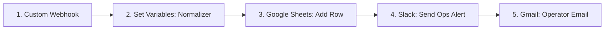

# Scenario 1: Intake & Normalization Automation Blueprint

This blueprint describes the Make.com scenario that automatically processes raw ideas, moments, and needs captured via the public Google Form, normalizes the inputs, inserts them into the **Intake Log** tab of the Intel Hub, and alerts the Content Operator.

---

## 1. Make.com Workflow Map

The workflow uses five core modules in series. 



*   **Module 1: Webhooks - Custom Webhook**
    *   *Role:* Listens for incoming POST requests from the Google Form Apps Script.
*   **Module 2: Tools - Set Multiple Variables**
    *   *Role:* Normalizes raw textual selections into system-compatible enums (e.g., status, pillars, audience types) and sets default values.
*   **Module 3: Google Sheets - Add a Row**
    *   *Role:* Appends a structured record into the **Intake Log** tab of the IMOL Intel Hub spreadsheet.
*   **Module 4: Slack - Create a Message (OAuth)**
    *   *Role:* Sends a rich text Slack message to the `#imol-ops-alerts` channel.
*   **Module 5: Gmail - Send an Email**
    *   *Role:* Backup notification sent directly to the Content Operator.

---

## 2. Inbound JSON Payload Schema (Google Form Webhook)

The webhook receives the following raw JSON body from the Google Form's `onSubmit` trigger script:

```json
{
  "timestamp": "2026-05-28T11:00:00Z",
  "submission_id": "form_sub_9832479",
  "submitter_email": "operator@imol.org",
  "raw_idea": "Consistency Anchor concept: We need to explain how a morning routine (e.g., making the bed) functions as an emotional anchor for youth.",
  "raw_pillar": "Hustle / Discipline",
  "raw_audience": "Youth / Parents",
  "suggested_channel": "TikTok / Reels",
  "source_reference": "Skills Library - Youth life-skills section on Consistency Anchors.",
  "visual_anchor": "Split screen of messy room vs. neat room with a 0-10 focus scale overlaid."
}
```

---

## 3. Variable Normalization Rules (Module 2: Set Multiple Variables)

The raw submissions from the form might have inconsistent capitalization or contain combined categories. Module 2 processes these using the following formulas:

| Variable Name | Formula / Logic | Target Standardized Value |
| :--- | :--- | :--- |
| **var_status** | *Hardcoded Default* | `Idea Captured` |
| **var_owner** | `if(submitter_email = "lead@imol.org"; "IMOL Lead"; "Content Operator")` | `Content Operator` / `IMOL Lead` |
| **var_pillar** | `if(contains(raw_pillar; "Hustle"); "Hustle"; if(contains(raw_pillar; "Health"); "Health"; "Heart"))` | `Hustle` / `Health` / `Heart` |
| **var_audience** | `if(contains(raw_audience; "Youth"); "Youth"; "Parents / Educators")` | `Youth` / `Parents / Educators` |
| **var_created_date**| `parseDate(timestamp; "YYYY-MM-DDThh:mm:ssZ")` | Date object for sheet write |

---

## 4. Google Sheets Field-by-Field Mapping (Module 3)

*   **Spreadsheet ID:** `{{var.IMOL_INTEL_HUB_SHEET_ID}}`
*   **Sheet Tab:** `Intake Log`

| Column | Column Header | Value Mapped / Make.com Formula |
| :--- | :--- | :--- |
| **A** | **Submission ID** | `{{1.submission_id}}` |
| **B** | **Date Captured** | `{{2.var_created_date}}` |
| **C** | **Source Submitter** | `{{1.submitter_email}}` |
| **D** | **Assigned Owner** | `{{2.var_owner}}` |
| **E** | **Workflow Status** | `{{2.var_status}}` |
| **F** | **Primary Audience** | `{{2.var_audience}}` |
| **G** | **3H Pillar** | `{{2.var_pillar}}` |
| **H** | **Raw Concept / Idea** | `{{1.raw_idea}}` |
| **I** | **Visual Anchor / Hook Ref** | `{{1.visual_anchor}}` |
| **J** | **Source Reference Notes** | `{{1.source_reference}}` |
| **K** | **Target Channels** | `{{1.suggested_channel}}` |

---

## 5. Rich Slack Alert Block Design (Module 4)

This Slack message is posted to `#imol-ops-alerts` to notify the Content Operator of the incoming row immediately.

*   **API Endpoint:** `chat.postMessage`
*   **Markdown Body Format:**

```text
🚨 *New IMOL Concept Captured* 🚨
An idea has been added to the *Intake Log* and is awaiting verification.

• *ID:* `{{1.submission_id}}`
• *Submitter:* `{{1.submitter_email}}`
• *Audience:* `{{2.var_audience}}` | *Pillar:* `{{2.var_pillar}}`
• *Concept:*
> {{1.raw_idea}}

• *Visual Anchor:* _"{{1.visual_anchor}}"_
• *Reference:* _"{{1.source_reference}}"_

👉 *Action:* View the Intel Hub and assign to *"Drafting"* when ready:
https://docs.google.com/spreadsheets/d/{{var.IMOL_INTEL_HUB_SHEET_ID}}/edit
```

---

## 6. Email Handoff Spec (Module 5)

In case the operator is offline or needs a direct task item, Gmail sends the following notification:

*   **To:** `operator@imol.org`
*   **Subject:** `[IMOL INTAKE] New Idea Received - {{2.var_pillar}} ({{2.var_audience}})`
*   **Body (HTML):**
    ```html
    <h3>Hello Content Operator,</h3>
    <p>A new raw moment or school request has been logged in the Intel Hub.</p>
    <ul>
      <li><strong>Pillar:</strong> {{2.var_pillar}}</li>
      <li><strong>Audience:</strong> {{2.var_audience}}</li>
      <li><strong>Suggested Channel:</strong> {{1.suggested_channel}}</li>
    </ul>
    <blockquote style="background: #f4f4f4; padding: 10px; border-left: 5px solid #00c;">
      <strong>Raw Idea:</strong> {{1.raw_idea}}
    </blockquote>
    <p><a href="https://docs.google.com/spreadsheets/d/{{var.IMOL_INTEL_HUB_SHEET_ID}}/edit">Click here to open the Intel Hub</a> and change status to <strong>Drafting</strong> to trigger the AI Drafting Package Engine.</p>
    <p>Best regards,<br>IMOL Automation Engine</p>
    ```

---

## 7. Human Verification Gate Rules

To maintain high content quality, raw ideas do **not** progress directly to the AI Drafter. 
1.  **Operator Audit:** The Content Operator must manually review the `Intake Log` row to confirm the raw idea is coherent and contains enough context.
2.  **Trigger Promotion:** The promotion trigger is the manual status change from `Idea Captured` to `Drafting` in Column E of the sheet. Changing this triggers Scenario 2.
