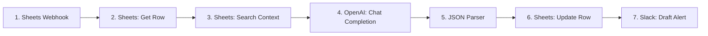

# Scenario 2: AI Drafting Package Engine Automation Blueprint

This blueprint describes the Make.com scenario that triggers when a row's status in the Intel Hub changes to `"Drafting"`. It extracts the row's raw context, injects relevant context from the Resource/Skills libraries, calls OpenAI's GPT-4o with a highly constrained system prompt, parses the structured response, and writes the 12-element output package into the **Script Queue** tab.

---

## 1. Make.com Workflow Map

The drafting pipeline consists of six primary modules.



*   **Module 1: Webhooks - Custom Webhook**
    *   *Role:* Listens for `onEdit` webhook triggered from the Google Sheet when Column E (Status) is changed to `"Drafting"`. Passes the Row Number and Sheet ID.
*   **Module 2: Google Sheets - Get a Row**
    *   *Role:* Fetches the raw idea and metadata from the modified row.
*   **Module 3: Google Sheets - Search Rows (Reference Context)**
    *   *Role:* Queries the **Skills Library** and **Resource Library** tabs using a filter like `3H Pillar = {{var_pillar}}` to retrieve approved vocabulary, 3H framework anchors, and safe terminology.
*   **Module 4: OpenAI - Create a Chat Completion (GPT-4o)**
    *   *Role:* Calls GPT-4o using a dedicated IMOL System Prompt. Enforces JSON output mode.
*   **Module 5: JSON - Parse JSON**
    *   *Role:* Validates and parses the GPT-4o output string into distinct key-value variables.
*   **Module 6: Google Sheets - Update a Row**
    *   *Role:* Writes the structured drafting package back to the target row (promoting it to the **Script Queue** tab structure or filling in the drafting columns).
*   **Module 7: Slack - Create a Message**
    *   *Role:* Alerts the Content Operator in `#imol-ops-alerts` that a draft is ready for manual review.

---

## 2. OpenAI System Prompt & Structural Guardrails

The OpenAI module (Module 4) is configured with the following system instructions to maintain the distinct #IMOL tone, safety requirements, and structural integrity.

### System Prompt (OpenAI Developer Instructions)
```text
You are the #IMOL (In My Own Lane) AI Drafting Assistant, specialized in generating highly engaging, educational, and school-safe content for the IMOL Continuum.

Core Frameworks to Apply:
- 3H Framework: Health (Physical/mental wellness), Heart (Relationships, parent alignment), Hustle (Youth life-skills, consistency anchors, discipline).
- Tone: Inspirational, authoritative yet youth-accessible, concrete, practical, and highly authentic. Avoid generic wellness platitudes or fluffy clickbait.

Strict Safety and Quality Guardrails:
1. SCHOOL-SAFE LANGUAGE ONLY: Never use slang, adult references, or controversial social themes.
2. NO PRIVATE STUDENT DETAILS: Use generic terms ("a student", "a young leader") instead of specific student names or schools.
3. NO UNSUPPORTED HEALTH CLAIMS: Focus on emotional regulation, sleep routines, preparation, and focus. Do not give medical or psychological diagnoses.
4. INTEGRATE CONTEXT: Inject the approved terms, skills, or anchors found in the provided Reference Context.
5. CTA CONSTRAINT: Create EXACTLY ONE clear Call to Action (CTA) at the end of the script. No double CTAs.
6. WORD COUNT CONSTRAINT: Keep the short-form script under 150 words.

You must output a single, valid JSON object matching the JSON Schema provided. Do not include any text, markdown blocks, or preambles outside the JSON.
```

---

## 3. Output Payload JSON Schema (GPT-4o Response)

To ensure the JSON parser (Module 5) does not fail, the OpenAI module uses the following schema definition. JSON Schema validation is enforced at the API level (using `response_format: {"type": "json_object"}`).

```json
{
  "$schema": "http://json-schema.org/draft-07/schema#",
  "title": "IMOLDraftPackage",
  "type": "object",
  "properties": {
    "idea_summary": { "type": "string", "description": "Short 1-2 sentence description of the narrative core." },
    "metadata": {
      "type": "object",
      "properties": {
        "audience": { "type": "string", "enum": ["Youth", "Parents / Educators", "Community Leaders"] },
        "pillar": { "type": "string", "enum": ["Health", "Heart", "Hustle"] },
        "channel": { "type": "string" },
        "school_use_case": { "type": "string", "description": "How this applies to classrooms or assemblies." },
        "cta": { "type": "string", "description": "The single Call to Action." }
      },
      "required": ["audience", "pillar", "channel", "school_use_case", "cta"]
    },
    "hooks": {
      "type": "object",
      "properties": {
        "contrarian": { "type": "string", "description": "Hook challenging a common belief." },
        "educational": { "type": "string", "description": "Hook leading with a direct teaching point." },
        "story_based": { "type": "string", "description": "Hook introducing a narrative or scenario." }
      },
      "required": ["contrarian", "educational", "story_based"]
    },
    "selected_hook_recommendation": { "type": "string", "enum": ["contrarian", "educational", "story_based"] },
    "short_form_script": { "type": "string", "description": "A spoken script of under 150 words." },
    "caption_post_copy": { "type": "string", "description": "Platform-optimized caption with relevant hashtags." },
    "storyboard_notes": { "type": "string", "description": "Visual layout description scene-by-scene." },
    "visual_anchor_suggestions": { "type": "string", "description": "B-roll prompts, text overlays, or active visual cues." },
    "school_use_alignment_note": { "type": "string", "description": "Classroom validation, safety checks, or educator links." },
    "sensitivity_flags": { "type": "string", "description": "Any words or claims that need a second eye (default: None)." },
    "revision_notes": { "type": "string", "description": "Self-identified areas for refinement." },
    "repurpose_angle": { "type": "string", "description": "Ideas to spin this into a school handout, parent newsletter, or community workshop." }
  },
  "required": [
    "idea_summary", "metadata", "hooks", "selected_hook_recommendation", 
    "short_form_script", "caption_post_copy", "storyboard_notes", 
    "visual_anchor_suggestions", "school_use_alignment_note", 
    "sensitivity_flags", "revision_notes", "repurpose_angle"
  ]
}
```

---

## 4. Google Sheets Drafting Update Map (Module 6)

Upon parsing the JSON, Module 6 writes the elements directly back to the target row in the **Script Queue** tab. 

*   **Spreadsheet ID:** `{{var.IMOL_INTEL_HUB_SHEET_ID}}`
*   **Sheet Tab:** `Script Queue`
*   **Target Row:** `{{1.row_number}}`

| Column | Column Header | Value Mapped / Make.com Formula |
| :--- | :--- | :--- |
| **A** | **Script ID** | `{{1.row_number}}` |
| **B** | **Idea Summary** | `{{5.idea_summary}}` |
| **C** | **Workflow Status** | `"Draft Ready for Review"` |
| **D** | **Selected Hook Recommendation** | `{{5.selected_hook_recommendation}}` |
| **E** | **Hook Options** | `Contrarian: {{5.hooks.contrarian}} \| Educational: {{5.hooks.educational}} \| Story: {{5.hooks.story_based}}` |
| **F** | **Short-Form Script (<150w)** | `{{5.short_form_script}}` |
| **G** | **Platform Caption / Hashtags** | `{{5.caption_post_copy}}` |
| **H** | **Storyboard & B-roll Notes** | `Visuals: {{5.storyboard_notes}} \n B-roll: {{5.visual_anchor_suggestions}}` |
| **I** | **School-Use Alignment & Guide** | `{{5.school_use_alignment_note}}` |
| **J** | **Repurpose & Handoff Angle** | `{{5.repurpose_angle}}` |
| **K** | **Sensitivity & Revision Flags** | `Flags: {{5.sensitivity_flags}} \n Notes: {{5.revision_notes}}` |
| **L** | **Human Review Approved By** | *Left blank for manual sign-off* |

---

## 5. Rich Slack Alert Block Design (Module 7)

*   **Target Channel:** `#imol-ops-alerts`
*   **Message Body (Markdown):**

```text
✍️ *AI Draft Generated & Ready for Review* ✍️
The AI Drafting Engine has processed Row `{{1.row_number}}` in the Intel Hub.

• *Pillar:* `{{5.metadata.pillar}}` | *Audience:* `{{5.metadata.audience}}`
• *Summary:* {{5.idea_summary}}
• *Script Word Count:* {{length(split(5.short_form_script; " "))}} words
• *Recommended Hook:* *{{5.selected_hook_recommendation}}*

⚠️ *Sensitivity & Quality Flags:*
> {{5.sensitivity_flags}}

👉 *Next Action Required:*
Please review the generated script, adjust visual anchors if necessary, and assign an approver in Column L of the *Script Queue*.

https://docs.google.com/spreadsheets/d/{{var.IMOL_INTEL_HUB_SHEET_ID}}/edit#gid=SCRIPT_QUEUE_TAB_ID
```

---

## 6. Verification Gate & Content Promotion Rule

The system enforces a **hard human verification checkpoint** before any draft package can proceed to production:

1.  **Draft Lock:** While the row is in `"Draft Ready for Review"`, it remains isolated on the Script Queue.
2.  **Review Check:** The Content Operator and IMOL Lead check the output against the guardrail checklist (no health claims, exactly one CTA, under 150 words).
3.  **Approved Action:** To move the row to the production pipeline, the operator must manually write their name in the `"Human Review Approved By"` (Column L) and change the `"Workflow Status"` (Column C) to `"Approved"`.
4.  **Promotion Trigger:** The change of Column C to `"Approved"` initiates Scenario 3.
