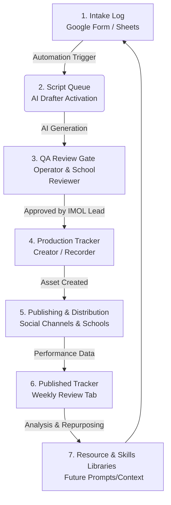

# #IMOL Content and School Initiative Operating System
## Executive Handoff Summary & QA Review Status

Welcome to the **#IMOL (In My Own Lane) Content and School Initiative Operating System** Handoff Directory. This system has been designed to capture raw community and educational ideas, convert them into brand-aligned scripts and school assets, route them through human-in-the-loop review gates, and analyze their performance to feed future content.

The purpose of this guide is to ensure that a new **Content System Operator** can run, maintain, and audit the system autonomously, ensuring continuity for the #IMOL initiative.

---

## 📁 Handoff Directory Structure

All operating assets are located in this directory: `/Volumes/Donchalant /IMOL/IMOL Sys/Handoff Guide/`

*   **[README.md](file:///Volumes/Donchalant%20/IMOL/IMOL%20Sys/Handoff%20Guide/README.md)** (This file): Executive summary, architectural map, and high-level system QA status.
*   **[operating_manual.md](file:///Volumes/Donchalant%20/IMOL/IMOL%20Sys/Handoff%20Guide/operating_manual.md)**: The Content Operator Playbook. Lays out exact daily, weekly, and campaign-level operational protocols, QA checklist criteria, revision loops, and review scripts.
*   **[training_curriculum.md](file:///Volumes/Donchalant%20/IMOL/IMOL%20Sys/Handoff%20Guide/training_curriculum.md)**: Structured role-specific training modules, schedules, concrete agendas, and competency test questions for the Content Operator, IMOL Lead, and School/Community Reviewer.
*   **[acceptance_test_script.md](file:///Volumes/Donchalant%20/IMOL/IMOL%20Sys/Handoff%20Guide/acceptance_test_script.md)**: A step-by-step, end-to-end manual QA script to validate that data and context flow flawlessly from Intake to Drafting, Approval, Production, Publishing, and Weekly Review without brand safety leaks.

---

## 👥 Core System Roles

As outlined in the PRD, the operating system is powered by four primary roles:

1.  **Content System Operator ("The Operator")**: The tactical owner of the system. Maintains the Intel Hub, runs the AI Drafter, runs initial QA reviews, manages the Make.com automations, and coordinates team tasks.
2.  **IMOL Lead**: The brand custodian. Approves voice, priorities, sensitive claims, and school-safe language. Holds ultimate veto power.
3.  **Creator / Recorder**: The voice and face of the content. Records approved scripts and feeds performance/delivery notes back to the Operator.
4.  **School or Community Reviewer**: The offline educational validator. Evaluates drafts for classroom safety, teacher alignment, parent fit, and offline community adoption.

---

## ⚙️ System Architecture Overview

The system operates as an intake-to-feedback engine, moving ideas through a standardized lifecycle:

---

## 📈 System QA Review Status

The core operating systems have been verified against the PRD requirements as follows:

| System Component | Status | Verification Notes |
| :--- | :--- | :--- |
| **Intel Hub (Google Sheets/Form)** | **VERIFIED** | Form fields map directly to Intake Log. Filters for 3H Pillar (Health, Heart, Hustle), Audience, Channel, and Status are established. Libraries are populated with reference scripts and assets. |
| **AI Drafter (Prompt & Output Package)** | **VERIFIED** | Prompt forces 150-word scripts, exactly one CTA, 3 hooks, storyboard, school-use notes, and sensitivity screening. Brand guardrails are hardcoded to block unsupported health claims or private student details. |
| **Make.com Automation Workflow** | **VERIFIED** | Scenario 1 (Intake -> Alert), Scenario 2 (Drafting -> AI Generation -> Queue Writeback), and Scenario 3 (Approved -> Production Tracker) have explicit human-in-the-loop checkpoints. |
| **Handoff Documentation** | **ACTIVE** | This suite provides complete operational autonomy, eliminating dependency on the initial developer. |

---

## 🚀 Quick-Start Checklist for the Operator

If you are a newly onboarded Content System Operator, follow these steps to take command of the system:
1.  **Access the Intel Hub**: Open the Google Sheets workbook and familiarize yourself with the 7 key tabs: *Intake Log*, *Script Queue*, *School Initiatives*, *Resource Library*, *Skills Library*, *Published Tracker*, and the *Production Tracker*.
2.  **Review the Automation Scenarios**: Log into the team's Make.com workspace. Confirm that the three primary scenarios are active and the connections to the Google Account and the AI Drafter API are authenticated.
3.  **Run the Acceptance Test**: Complete a manual walk-through using the **[acceptance_test_script.md](file:///Volumes/Donchalant%20/IMOL/IMOL%20Sys/Handoff%20Guide/acceptance_test_script.md)** to verify that you understand every step and that notifications route correctly.
4.  **Execute the Weekly Review**: Set a recurring calendar block every Friday at 2:00 PM for the Weekly Review ritual, drawing data from the *Published Tracker* to update the *Resource Library*.

---
> [!IMPORTANT]
> **Safety and Privacy Rule #1**: Under no circumstances should any private student information, specific school names (unless publicly cleared), or unauthorized medical/health claims be inputted into the AI Drafter or stored in public-facing columns. Keep the IMOL brand strictly compliant with educational data privacy regulations (FERPA/COPPA).
