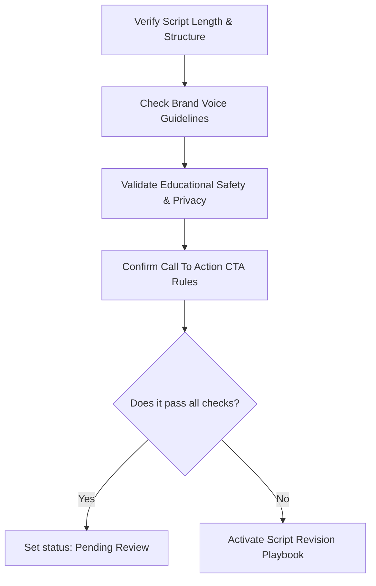

# #IMOL Content and School Initiative Operating Manual
## The Content Operator Playbook

---

## 1. Introduction & The IMOL Mindset

The **#IMOL (In My Own Lane) Continuum** is more than a social media channel or a set of school templates—it is an educational philosophy built around three foundational pillars:
*   **Health (Physical & Mental Wellness)**: Helping youth, parents, and educators establish somatic stability and emotional baseline control.
*   **Heart (Character & Core Identity)**: Nurturing self-awareness, personal values, emotional regulation, and deep community adoption.
*   **Hustle (Skills & Practical Application)**: Arming youth with practical life skills, consistency anchors, and educational growth strategies.

As the **Content System Operator**, your mindset must balance **automation speed** with **brand safety**. You are the protector of the #IMOL voice. While AI generates initial drafts and Make.com routes the data, your human review is the ultimate gate. You ensure that every piece of content published or distributed in classrooms is school-safe, FERPA/COPPA compliant, scientifically accurate, and tightly aligned with our branding.

---

## 2. Roles & Responsibilities Matrix

To prevent operational friction, ensure all tasks are routed to the correct owner.

```
┌────────────────────────────────────────────────────────────────────────────────────────┐
│                                   CORE TEAM ROLES                                      │
├──────────────────────┬─────────────────────────────────────────────────────────────────┤
│ Role                 │ Core Responsibility                                             │
├──────────────────────┼─────────────────────────────────────────────────────────────────┤
│ Content System       │ - Manages and audits the Intel Hub (Google Sheets).             │
│ Operator             │ - Runs and troubleshoots AI Drafter prompt inputs.               │
│ ("The Operator")     │ - Conducts initial QA reviews and manages automated workflows.   │
│                      │ - Triggers and tracks tasks in the Production Tracker.           │
├──────────────────────┼─────────────────────────────────────────────────────────────────┤
│ IMOL Lead            │ - Reviews and signs off on final high-priority script drafts.   │
│                      │ - Sets strategic campaign directives and pillar focuses.        │
│                      │ - Reviews sensitive claims or scientific references.             │
├──────────────────────┼─────────────────────────────────────────────────────────────────┤
│ Creator or Recorder  │ - Records video/audio assets based on approved scripts.         │
│                      │ - Provides delivery-level feedback (e.g., readability).         │
│                      │ - Submits raw recorded files to the designated workspace.        │
├──────────────────────┼─────────────────────────────────────────────────────────────────┤
│ School or Community  │ - Validates safety and pedagogical fit for classrooms.          │
│ Reviewer             │ - Audits school-use assets against teacher needs.               │
│                      │ - Tracks parent engagement and school adoption metrics.         │
└──────────────────────┴─────────────────────────────────────────────────────────────────┘
```

---

## 3. Daily Operating Cadence

Your daily operations are structured into a 3-part checkpoint system to keep work moving steadily:

### 🌅 Morning Check (09:00 AM - 10:00 AM)
1.  **Open the Intel Hub**: Inspect the **Intake Log** tab for new submissions (via the Google Form) from team members, teachers, or community members.
2.  **Verify Intake Data**: Review incoming ideas. Clean up typos, assign correct tags for **Audience** (Youth, Parents, Teachers, Community), **3H Pillar** (Health, Heart, Hustle), and target **Channel**.
3.  **Audit Make.com Alerts**: Check the Make.com dashboard. If a scenario has failed (e.g., a row was incompletely filled out and threw an error), locate the affected row in the Google Sheet and address the warning flag.

### ☀️ Mid-Day Operations (01:00 PM - 02:30 PM)
1.  **Execute AI Drafting Runs**:
    *   Find rows in the **Intake Log** that have been approved for drafting by changing their status to `Ready for AI`.
    *   Trigger the automation (or manually run the step) to send the row into the **AI Drafter**.
    *   Verify that the resulting Draft Package (Hooks, Script, Captions, Storyboards, School Notes, Sensitivity Flags) successfully writes back into the **Script Queue** tab.
2.  **Conduct Initial Operator QA**: Run the generated scripts through the **HIL-QA (Human-in-the-Loop Quality Assurance) Checklist** (see Section 6). If it passes, flip the status to `Pending Review`.
3.  **Notify Reviewers**:
    *   Route scripts marked for social media to the **IMOL Lead** by pinging them with the script link.
    *   Route scripts with a school use case to the **School or Community Reviewer**.

### 🌇 Afternoon Wrap-Up (04:30 PM - 05:00 PM)
1.  **Update the Production Tracker**: Identify any scripts that were approved by the IMOL Lead and School Reviewer today. Change their status in the **Script Queue** to `Approved for Production`.
2.  **Push to Creator**: Ensure the automation has successfully created a row in the **Production Tracker** with the script text, due date, owner, B-roll guides, and visual anchors.
3.  **Backup and Clean**: Ensure that all links to assets (Google Drive, recorded files, etc.) are correctly formatted.

---

## 4. Weekly Operating Cadence

The weekly cycle is designed to review high-level performance, clean up archives, and feed findings back into the system.

### 📅 Monday: Weekly Content & Planning Alignment (10:00 AM)
*   **Agenda**: Meet with the IMOL Lead and School Reviewer. Review the upcoming week’s campaign focus (e.g., "Parent Backpacks" or "Consistency Binders").
*   **Deliverable**: Lock in the intake queue for the week and set production deadlines.

### 📅 Wednesday: Middle-of-Week Production Sync (02:00 PM)
*   **Agenda**: Check in with the Creator/Recorder. Track any recording bottlenecks or script adjustments that were made on the fly. Update any manual revision notes in the Intel Hub.

### 📅 Friday: The #IMOL Performance & Feedback Loop (02:00 PM - 04:00 PM)
This is your most important analytical task. **Do not skip this ritual.**
1.  **Retrieve Published Metrics**: Pull metrics (views, comments, shares, school adoption rates, teacher downloads) from social channels and school distribution logs.
2.  **Update Published Tracker**: Input these metrics into the **Published Tracker** tab.
3.  **Conduct the Performance Review**:
    *   **Top-Performing Patterns**: Identify the top 3 assets. What 3H pillar did they target? What hook style did they use? Why did it resonate?
    *   **Weak-Performing Patterns**: Identify any underperforming assets. Did they lack a clear CTA? Was the hook too generic?
4.  **Perform Resource Migration**:
    *   Copy the scripts and visual concepts of the top 3 performing assets from the Script Queue.
    *   Paste them into the **Resource Library** and **Skills Library** as approved system reference assets.
    *   Add a tag like `Top Performer [Month/Year]` so the AI Drafter can refer to them as few-shot training examples in future runs.

---

## 5. Campaign-Level Cadence

When launching a new #IMOL Initiative campaign (e.g., introducing the *Teacher Resource Binder* or the *0-10 Scale for Emotional Regulation* to a new school district), execute the following:

1.  **Resource Seeding**: Ensure that the **Skills Library** and **Resource Library** are populated with exact approved copy, diagrams, and reference sheets for the campaign's topic.
2.  **Intake Generation**: Work with the School Reviewer to generate 5-10 specific intake concepts mapped to school moments (e.g., "Teacher is overwhelmed in the morning", "Student is in the red zone on the 0-10 scale").
3.  **Drafting Batch**: Run these through the AI Drafter. Ensure that the school-use note points directly to the campaign's PDF backpack or binder link.
4.  **QA Auditing**: Set aside a dedicated 2-hour window with the School Reviewer to batch-approve the materials, ensuring absolute school safety.

---

## 6. Human-in-the-Loop (HIL) QA Check Procedures

Every script generated by the AI Drafter **must** undergo manual verification before it is sent to the IMOL Lead. As the Operator, you will perform the following steps:



### Step 1: Length & Structure Verification
*   **Word Count**: Copy the script into a word counter. Ensure that short-form scripts are strictly **under 150 words**. (Long scripts are rejected by creators and get cut off in editing).
*   **Hook Check**: Ensure the AI has provided the three requested hooks (Contrarian, Educational, Story-based) and has provided a logical recommendation.
*   **Visual Direction**: Confirm that storyboard notes and B-roll descriptions match the text. (e.g., if the script mentions a "Consistency Binder," the B-roll should describe showing the binder).

### Step 2: Brand Voice & Pillars Check
*   **The 3H Pillars**: The script must tie back to **Health, Heart, or Hustle** explicitly. Vague or generic self-help copy must be rewritten.
*   **IMOL Vocabulary**: Verify the correct usage of our core intellectual properties:
    *   *0-10 Scale Reference*: Make sure it refers to emotional baselines, not arbitrary grades.
    *   *Backpacks and Binders*: Ensure school resources are referred to as "Backpacks" (parent-facing) or "Binders" (teacher-facing).
    *   *AI-ja context*: Ensure cultural references are respectful, native, and authentic.
*   **No Fluff**: Delete phrases like "Hey guys, welcome back to my channel," or "Make sure to like and subscribe." Start immediately with the chosen hook.

### Step 3: Educational Safety & Privacy Auditing
*   **FERPA/COPPA Rules**: Under no circumstances should real names of students, schools, or teachers be used in scripts. All examples must be fictionalized or anonymous (e.g., "A middle school teacher in our community...").
*   **Claim Validation**: Verify that the script does not make unsupported scientific, medical, or psychological claims (e.g., "Using this breathing exercise cures anxiety in 30 seconds" -> Change to "Using this somatic anchor helps regulate the nervous system when feeling overwhelmed").

---

## 7. Role-Specific Final Approval Checklists

Use these lists to formally approve or reject assets. A script is "Approved for Production" only when both appropriate columns are marked "Pass".

### 1. Content Operator Checklist (Structure & Brand)
*   [ ] **Length**: Short-form script is < 150 words.
*   [ ] **Structure**: Contains exactly one Hook, one core message body, and exactly one CTA.
*   [ ] **B-Roll & Storyboard**: B-roll triggers are clearly detailed in brackets `[B-roll: Creator holds up consistency binder]`.
*   [ ] **Formatting**: No weird AI markdowns (like asterisks for bolding *within* spoken lines, which confuses recorders).

### 2. School / Community Reviewer Checklist (Pedagogical Safety)
*   [ ] **Student Privacy**: No identifiable details of kids, families, or specific school personnel.
*   [ ] **Safe Language**: Zero offensive language, violent metaphors, or highly sensitive emotional triggers without warning.
*   [ ] **Practical Value**: The school-use note links to a real physical asset (e.g., Teacher Resource Binder, backpack sheets) that is accessible.
*   [ ] **Parent Fit**: Language is respectful, supportive, and avoids blaming parents or educators.

### 3. IMOL Lead Checklist (Strategic Fit & Final Voice)
*   [ ] **Brand Authenticity**: The voice sounds authentic to the #IMOL brand (firm but empathetic, gritty, real, focused on high standards and self-sustainability).
*   [ ] **Accuracy**: All somatic, health, or hustle claims are verified and defensible.
*   [ ] **Strategic Alignment**: Matches the current week's marketing/community priorities.

---

## 8. The Script Revision Playbook

If a script fails QA, do not delete it. Follow these steps to revise it:

### The Rejection Protocol
1.  **Mark the Status**: Change the row status to `Needs Revision`.
2.  **Log the Rejection Reason**: In the `Revision Notes` column, write a specific comment explaining why it failed. Do not write "voice is off." Write "Hook is too generic. Make it more contrarian and focus on the 0-10 Scale."

### AI Re-generation Prompt Template
If you are using the AI Drafter to revise the script, copy the failed output, paste it into your AI interface, and use this exact prompt:

```other
SYSTEM INSTRUCTION: You are the #IMOL AI Drafter. You must revise a script that failed our QA check.

REJECTION CRITERIA DETECTED: [Insert reason from the Revision Notes, e.g., "Failed the 150-word limit" / "Included unsupported health claims" / "Used non-school-safe language"]

FAILED DRAFT PACK:
[Paste failed draft here]

REVISION INSTRUCTIONS:
1. Fix the specific rejection criteria identified above.
2. Keep the script under 150 words.
3. Ensure there is only ONE Call to Action.
4. Maintain the authentic #IMOL voice (empathetic, gritty, practical).
5. Output in the standard 11-part Draft Package format.
```

### Manual Patching Protocol
If the script only requires a minor fix (e.g., word count is 160 words, or a word needs to be swapped for classroom safety), edit the text **directly in the Script Queue row**. Do not waste time re-running the AI for minor typographical edits. Note the manual adjustment in the `Revision Notes` column (e.g., "Operator manually trimmed 15 words to hit length target").

---

## 9. Published Tracker & Resource Library Maintenance

To ensure the system continuously learns and improves, you must maintain the connection between published results and the asset library.

### Metric Thresholds for Library Migration
Every Friday, during the weekly review, examine the **Published Tracker** tab. If a content asset meets **any** of the following thresholds, it is classified as a "Champion Asset" and must be migrated:
*   **Social Channels**: Top 10% in views, or an engagement rate (likes + comments + shares / views) exceeding **5%**.
*   **School Channels**: Download rate of parent backpacks or teacher resource sheets exceeding **15%** of the targeted user base, or positive written feedback from at least 3 teachers.

### How to Migrate a Champion Asset
1.  **Copy the Original Row**: Copy the entire row from the **Script Queue** or the **Published Tracker**.
2.  **Paste into the Resource Library**: Open the **Resource Library** tab. Paste the row at the bottom.
3.  **Add Metadata Tagging**:
    *   In the `Tags` or `Metadata` column, add `[CHAMPION_ASSET_YYYYMMDD]`.
    *   Add a brief note in the `Operator Notes` column: "Resonated heavily with parents. Highlighted the 0-10 Scale concept. Re-use for next back-to-school campaign."
4.  **Skills Library Extract**: If the script had an exceptionally strong hook, copy the hook text and paste it into the **Skills Library** tab under the `Hook Templates` section. This makes it instantly available for future AI drafting prompts.

---

## 10. System Troubleshooting & Maintenance

As the Operator, you are the technical administrator. Here are solutions to common technical issues:

### ⚠️ Issue A: Make.com Automation is throwing a "403 Forbidden" or "Connection Broken" Error
*   **Cause**: The connection between Make.com and Google Workspace or your AI API provider has expired or been de-authorized.
*   **Solution**:
    1. Log into Make.com and navigate to the **Connections** tab.
    2. Find the Google Sheets or Open AI connection and click **Re-authorize**.
    3. Run a single test row through to ensure the scenario executes fully.

### ⚠️ Issue B: Rows in the Intel Hub are getting skipped or not triggering the AI Drafter
*   **Cause**: The Make.com trigger is looking for an exact status text matching (e.g., `Ready for AI`) but a team member typed it differently (e.g., `ready for ai` or `Ready for drafting`).
*   **Solution**:
    1. Standardize column selections. Set up a **Data Validation / Dropdown** constraint on the `Status` column in Google Sheets.
    2. Only allow inputs from the approved list: `Intake`, `Ready for AI`, `Needs Revision`, `Pending Review`, `Approved for Production`, `Published`.

### ⚠️ Issue C: The AI Drafter is generating generic, robotic, or out-of-character copy
*   **Cause**: The system context is missing actual reference material, or the prompt parameters are failing to reference the Libraries.
*   **Solution**:
    1. Ensure your Make.com workflow is pulling the context from the **Resource Library** and **Skills Library** tabs and injecting it into the prompt.
    2. If the libraries are empty, load at least 3 approved reference scripts. The AI needs "few-shot" examples to understand the voice.

---
> [!TIP]
> **Operator Efficiency Tip**: Always keep a browser tab open to the Google Sheets Intel Hub and a second tab to Make.com. Set up email or Slack alerts for Make.com failures so you can resolve connection issues before the team notices.
